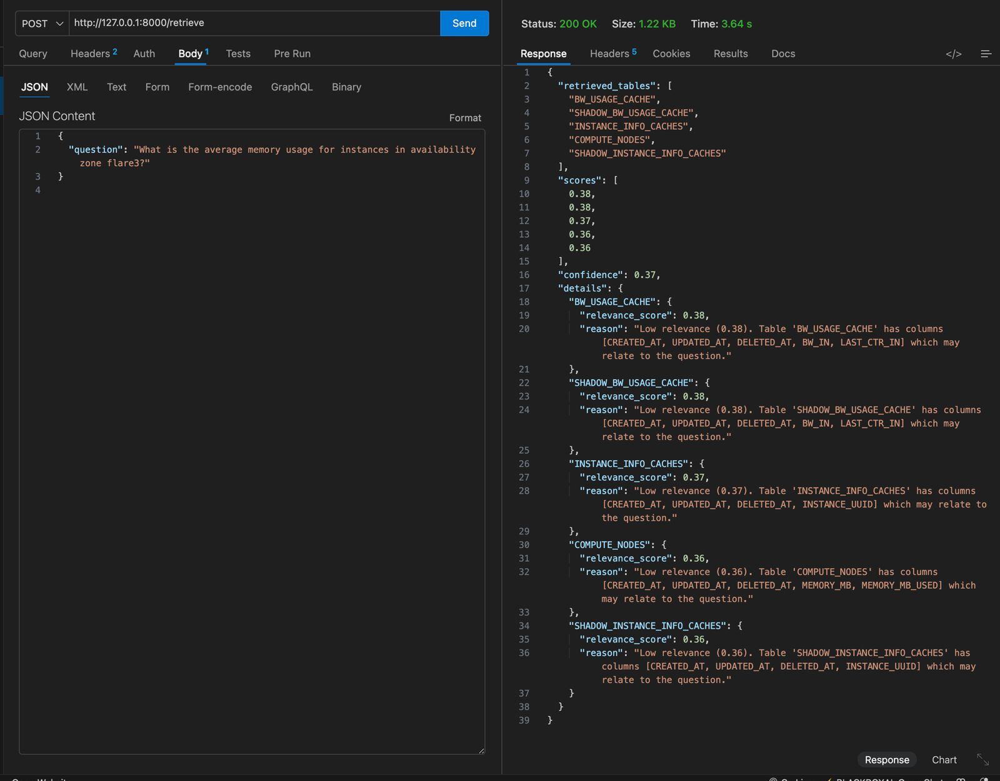
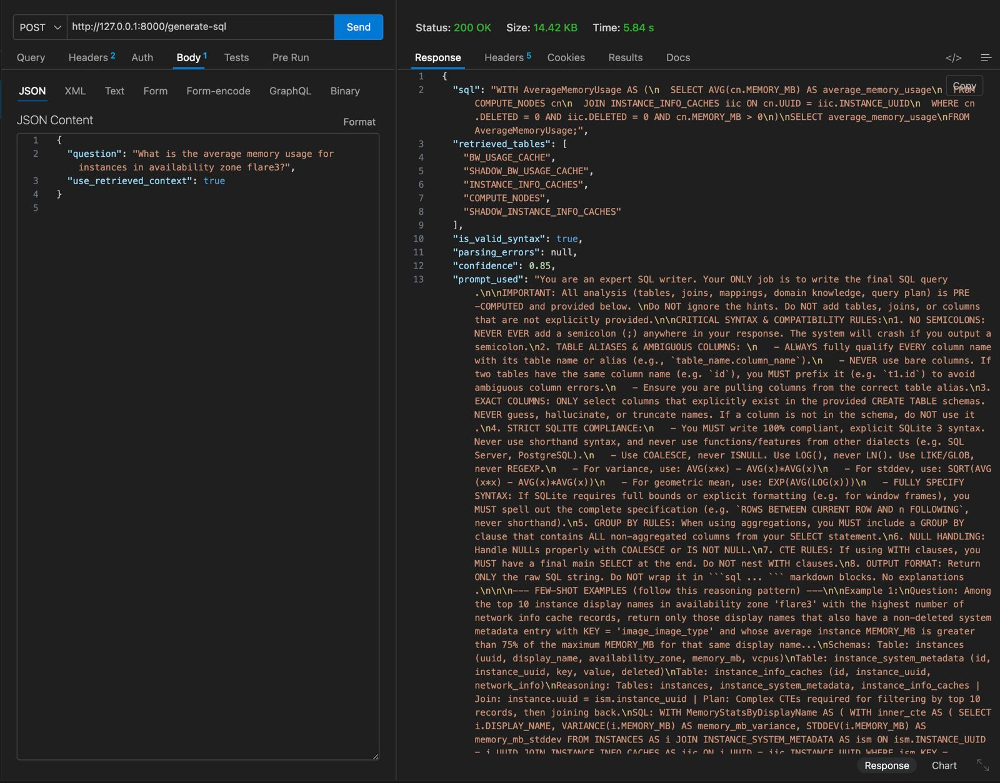
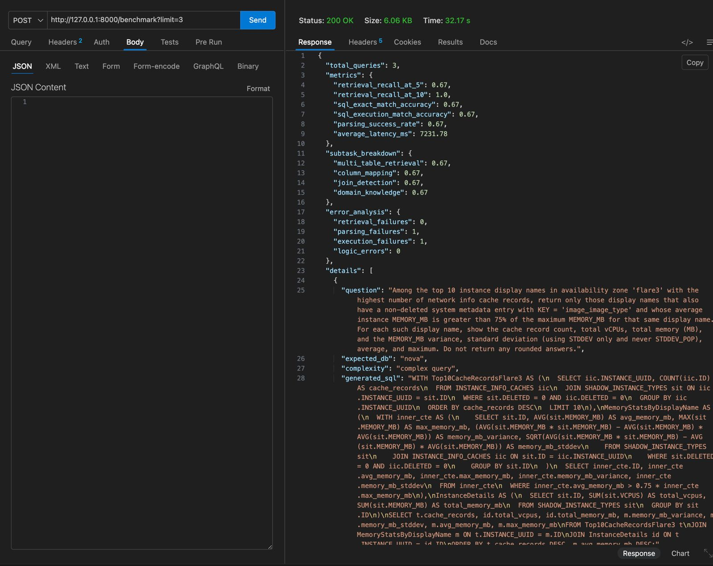

# Enterprise Text-to-SQL Pipeline

A Text-to-SQL pipeline designed for the BEAVER benchmark. The system uses a modular architecture for semantic retrieval, schema linking, domain knowledge resolution, query planning, and SQL generation.

---

## Key Features
- **Semantic Retrieval:** Uses vector embeddings to find relevant tables before generation.
- **Validation Loop:** Checks SQL syntax dynamically and retries if execution fails.
- **Safety:** Blocks DROP, DELETE, and UPDATE operations for read-only database safety.
- **Benchmarking:** Built-in evaluation script for latency, recall, and accuracy metrics.

---

## Folder Structure

```text
enterprise-text-to-sql/
├── app/
│   ├── api/                 # FastAPI router and endpoints
│   ├── core/                # Database setup and configuration
│   ├── models/              # Pydantic schemas
│   ├── services/            # Retrieval, LLM generation, and validation logic
│   ├── utils/               # Prompts and helper functions
│   ├── benchmark_questions.json 
│   ├── domain_knowledge.json    
│   └── table_schemas.json       
├── images/                  # Postman screenshots
├── scripts/                 # Mock DB setup scripts
├── .env.example             
├── requirements.txt         
└── README.md                
```

---

## Quick Start

### 1. Install Dependencies
Run the automated setup script. This script automatically detects Python 3.12, creates a virtual environment, and strictly installs the locked dependencies:
```bash
./setup.sh
```

If the script fails because you don't have Python 3.12 installed, follow the terminal instructions to install it. Once finished, activate your environment:
```bash
source venv/bin/activate
```

### 2. Configure Environment
Create a `.env` file based on `.env.example`:
```ini
GROQ_API_KEY=your_api_key_here
```

### 3. Setup Database
Run the setup script to download the dataset and build the local SQLite database:
```bash
python scripts/setup_mock_db.py
```

### 4. Start Server
```bash
uvicorn app.main:app --reload --port 8000
```
Swagger UI is available at `http://localhost:8000/docs`.

---

## 1. System Architecture

```text
User Question
     │
     ▼
┌─────────────┐     ┌──────────────┐
│  Embedder   │────▶│  ChromaDB    │
│  (MiniLM)   │     │  (Retriever) │
└─────────────┘     └──────┬───────┘
                           │ Top-K schemas
                           ▼
                    ┌──────────────┐
                    │  Schema      │
                    │  Linker      │
                    └──────┬───────┘
                           │ Explicit JOINs
                           ▼
                    ┌──────────────┐
                    │ Domain       │
                    │ Resolver     │
                    └──────┬───────┘
                           │ Predicates
                           ▼
                    ┌──────────────┐
                    │ Query        │
                    │ Planner      │
                    └──────┬───────┘
                           │ Prompt
                           ▼
                    ┌──────────────┐
                    │ LLM          │
                    │ (Generator)  │
                    └──────┬───────┘
                           │ Raw SQL
                           ▼
                    ┌──────────────┐
                    │ SQL          │
                    │ Validator    │
                    └──────┬───────┘
                           │ Validated SQL
                           ▼
                    ┌──────────────┐
                    │ SQL          │
                    │ Executor     │
                    └──────────────┘
```

---

## 2. Components & Implementation Approach

The system focuses on minimizing direct LLM logic generation to improve accuracy. The workflow is split into programmatic steps:

1. **Retrieval Component (`retrieval.py`)**: Uses `SentenceTransformers` to convert database schemas into vectors. It retrieves only the required tables using semantic search to minimize token limits.
2. **Schema Linker (`schema_linker.py`)**: Pre-computes explicit foreign key relationships and JOIN conditions programmatically rather than asking the LLM to infer table connections.
3. **Domain Resolver (`domain_resolver.py`)**: Matches business terms against the `domain_knowledge.json` index to generate exact SQL `WHERE` predicates.
4. **Query Planner (`query_planner.py`)**: Analyzes schema complexity and enforces SQL structures (like CTEs) for aggregations.
5. **SQL Generator (`sql_generator.py`)**: Synthesizes the final prompt with the resolved joins, predicates, and tables, which is then passed to the LLM API.
6. **SQL Validator (`validator.py`)**: Uses `sqlparse` to block mutative operations (`DROP`, `DELETE`). If a syntax error occurs during execution, the error message is fed back into the LLM for correction.

---

## 3. Screenshots

### 1. `POST /retrieve` Endpoint


### 3. Generate SQL (`/generate-sql`)


### 4. Run Benchmark (`/benchmark`)


---

## 4. API Endpoints

### `POST /retrieve`
Retrieves relevant table schemas for a question.

**Request:**
```json
{
  "question": "Which departments have more than 100 students?"
}
```

**Response:**
```json
{
  "retrieved_tables": ["STUDENT_DEPARTMENT", "COURSE_CATALOG_SUBJECT_OFFERED"],
  "scores": [0.92, 0.87],
  "confidence": 0.90,
  "details": {
    "STUDENT_DEPARTMENT": {
      "relevance_score": 0.92,
      "reason": "Moderate relevance (0.92). Table 'STUDENT_DEPARTMENT' has columns [DEPARTMENT_CODE]..."
    }
  }
}
```

### `POST /generate-sql`
Generates a SQL query from the natural language question.

**Request:**
```json
{
  "question": "What are the top 5 instances with the most memory?"
}
```

**Response:**
```json
{
  "sql": "WITH top_instances AS (\n  SELECT i.ID, i.MEMORY_MB, c.SUPPORTED_INSTANCES\n  FROM INSTANCES i\n  JOIN COMPUTE_NODES c ON i.MEMORY_MB = c.MEMORY_MB\n  GROUP BY i.ID, i.MEMORY_MB, c.SUPPORTED_INSTANCES\n)\nSELECT * FROM top_instances ORDER BY MEMORY_MB DESC LIMIT 5;",
  "retrieved_tables": ["INSTANCE_TYPES", "COMPUTE_NODES", "INSTANCES"],
  "is_valid_syntax": true,
  "parsing_errors": null,
  "confidence": 0.85,
  "prompt_used": "You are an expert SQL writer..."
}
```

### `POST /benchmark`
Runs the evaluation suite.

**Request:**
```bash
curl -X POST "http://localhost:8000/benchmark?limit=25"
```

**Response:**
```json
{
  "total_queries": 25,
  "metrics": {
    "retrieval_recall_at_5": 0.88,
    "retrieval_recall_at_10": 0.92,
    "sql_exact_match_accuracy": 0.52,
    "sql_execution_match_accuracy": 0.68,
    "parsing_success_rate": 0.96,
    "average_latency_ms": 850.5
  },
  "subtask_breakdown": {
    "multi_table_retrieval": 0.88,
    "column_mapping": 0.72,
    "join_detection": 0.65,
    "domain_knowledge": 0.58
  },
  "error_analysis": {
    "retrieval_failures": 3,
    "parsing_failures": 1,
    "execution_failures": 8,
    "logic_errors": 6
  }
}
```